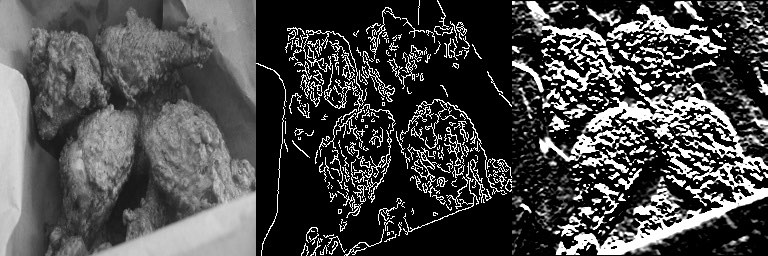

# Project: Labradoodle or Fried Chicken? In Black and White.


### [Full Project Description](doc/project3_desc.html)

Term: Spring 2017

+ Team #10
+ Team members
	+ Zixuan Guan
	+ Senyao Han
	+ Yuan Mei
	+ Xuanzi Xu
	+ Galen Simmons

+ Project summary: In this project, we created a classification engine for grayscale images of poodles versus images of fried chickens.  To demonstrate our methods, we created an ipython notebook contained in doc/main_notebook.ipynb.  In order to replicate the results we achieved, it is necessary to configure a virtual environment with several key packages including `scikit-learn` and `graphlab-create`.  Therefore, we provide an `environment.yml` file, which contains the configuration info necessary to build the virtual environment.  Below are instructions.

First, install the virtual environment.  Execute:
	`conda env create -f environment.yml`

Next, activate the environment.  Execute:
	`source activate gl-env`

Now, open jupyter notebook:
	`jupyter notebook`

In order to process, the images raw images, we provide two python scripts that must be run prior to running the notebook file: `resize_images.py` and `generate_sframe.py`.  To process a new batch of jpg images, copy the raw jpg images into `data/img_raw`, and then execute:
 	`python resize_images.py`
	`python generate_sframe.py`
Make sure that the above command is executed in the virtual environment.  Usually the terminal will display the name of the virtual environment at the prompt in the following format:
	`(gl-env) username$`

At this point, there will be images in the `data/img_edge`, `data/img_resize`, and `data/img_sobel` folders.  Additionally, there will be SFrame objects saved in the `data/sframe` folder.  We have one last step to run the jupyter notebook.  We have to change the base_dir variable in the `main_notebook.ipynb` file to reflect our local project directory.

**Contribution statement**: ([default](doc/a_note_on_contributions.md)) Galen contributed image processing and notebook code and commentary.   Xuanzi did neural network linear and kernal SVM and tune the models as well as using principal component analysis to reduce the feature dimensions.
All team members contributed equally in all stages of this project. All team members approve our work presented in this GitHub repository including this contributions statement.

Following [suggestions](http://nicercode.github.io/blog/2013-04-05-projects/) by [RICH FITZJOHN](http://nicercode.github.io/about/#Team) (@richfitz). This folder is orgarnized as follows.

```
proj/
├── lib/
├── data/
├── doc/
├── figs/
└── output/
```

Please see each subfolder for a README file.
